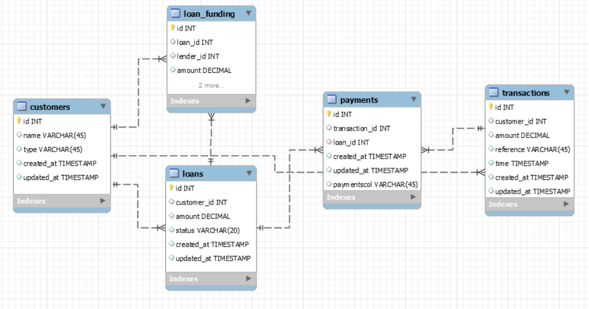
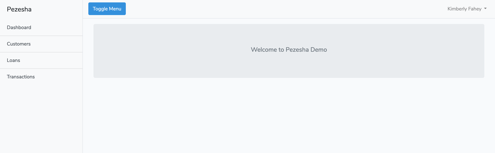
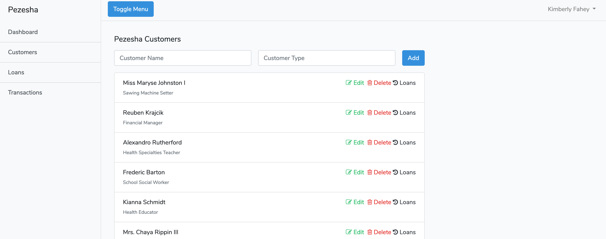
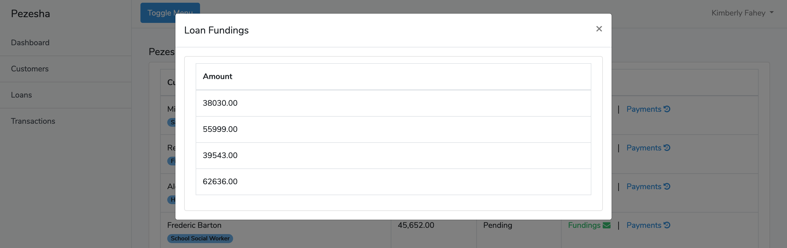
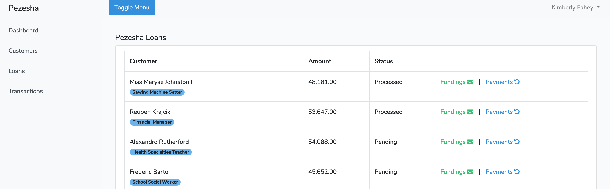
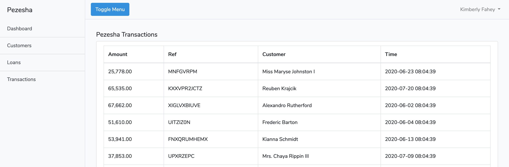

## PEZESHA

Pezesha Laravel Web App based on the following ER Diagram

.

#### Demo
- [Click here to view demo](http://104.248.33.207)
- email: kevinmulugu@gmail.com
- password: password


### About this project

1. Front end interface is consuming the Laravel APIs using VueJS
1. Laravel APIs are authenticated

### INSTALLATION GUIDE
1. Clone the project
`git clone https://github.com/mulugu/pezesha.git`
1. ``cd`` to the project and run ``composer install`` on the terminal to install php dependencies
1. copy the `.env-example` file to `.env` file 
1. Create a Mysql database and edit the ``.env`` to reflect your connections as follows:
    ```dotenv
    DB_CONNECTION=mysql
    DB_HOST=127.0.0.1
    DB_PORT=3306
    DB_DATABASE=dbname
    DB_USERNAME=myuser
    DB_PASSWORD=mypass
    ```
1. Migrate your migrations: `php artisan migrate`
1. Seed the database: `php artisan db:seed`
1. Generate application encryption key: `php artisan key:generate`
1. Run `npm install && npm run dev` to install node.js dependencies
1. Start your development server and start testing the web app. `php artisan serve --port 8080`
1. That's all!

###Screenshots
Customer List | Customers
------------ | -------------
 | 
 Fundings/Payments modal | Loans
|  | |
 Transactions | 
 |

